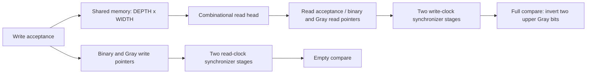

# Asynchronous FIFO: RTL and verification

A dual-clock, first-word-fall-through FIFO in SystemVerilog. Binary pointers address storage; registered Gray pointers cross through two-stage synchronizers. This repository contains a runnable simulation regression, local transition proofs, bounded data-safety checks, and reachable formal covers.

## Interface contract

- `DEPTH`: power of two, at least **4**. `WIDTH`: at least **1**. Invalid values fail elaboration or simulation initialization. No claim that every legal parameter has been verified.
- A write is accepted at a rising `wr_clk` edge iff `wr_rst_n && wr_en && !full` holds immediately before the edge. A read is accepted at a rising `rd_clk` edge iff `rd_rst_n && rd_en && !empty` holds.
- Requests at full/empty are **legal and ignored**, not interface violations. The corresponding pointer holds. No write is performed during write reset.
- `rd_data` is a combinational view of the head word, valid when read reset is released and `!empty`. There is no output register or extra read latency. Sample the current word on the accepted read edge; the port then exposes the next word. Data while empty/reset is unspecified.
- Reset is a **coordinated flush of both domains**. Quiesce the interfaces; assert both active-low resets together, including when a clock is paused. Hold both asserted while clocks restart; provide at least two running edges in each domain. Deassert each reset synchronously to its own clock using external reset synchronizers, and resume requests only once both domains are released. RTL does not supply a reset-completion handshake.
- Reset discards buffered transactions; memory bits are not cleared. Resetting one domain independently is unsupported and does not preserve queued data.
- Two-stage synchronization makes flag deassertion conservative: freeing/adding a word takes receiving-clock synchronization latency to become visible. No fixed wall-clock bound exists if a clock stops.

## Architecture



The extra pointer bit distinguishes wraparound. Only accepted operations advance pointers. This uses a combinational read array; generic synthesis may implement registers/muxes, not a target FPGA block RAM. Memory inference and read-during-write behavior must be reviewed for the target technology.

## Run

Tested locally on Apple Silicon: Icarus Verilog **13.0**, Verilator **5.048**, Yosys **0.66**, Z3 **4.16.0**, Python **3.9.6**. SBY source is pinned to `b1a1e98cba941ec8433f8dc27f416cd7bb7f14be`; its Python dependency is Click **8.1.8**. Homebrew versions can move; these are tested versions, not a hermetic toolchain lock.

```sh
brew install icarus-verilog verilator yosys z3
bash scripts/check.sh                 # lint, generic synthesis, five simulations
SEED=20260905 bash sim/run.sh          # second deterministic seed
python3 scripts/parameters.py         # invalid parameter rejection
python3 scripts/negative.py           # temporary corrupted-data DUT must fail
bash scripts/setup-formal.sh          # isolated venv and pinned SBY checkout
bash scripts/formal.sh                # prove + bmc + cover
python3 scripts/formal-negative.py    # temporary corruption must yield counterexample
```

For individual tasks use `bash scripts/formal.sh prove`, `bmc`, or `cover`. Each formal task has a 600-second timeout. A timeout fails the command. `SBY_PYTHON` and `SBY_SOURCE` can select an existing isolated SBY setup.

Logs go to `build/` or `formal/fifo_*/`. To obtain simulation waveforms, rerun a compiled configuration with `vvp build/d4_w1_3_7_0.vvp +SEED=1 +WAVES`; this writes `failure.vcd` in the current directory. All scripts propagate failures. CI has separate simulation and formal jobs and uploads logs and formal counterexample/cover waveforms. Remote CI status is separate from local evidence below.

## Verification matrix and observed results

[Checked-in evidence and source fingerprints](docs/results/README.md) identify this revision's tested sources. These are transaction counts, not coverage percentages or independent test-case counts.

| Layer | Scope | Observed result |
|---|---|---|
| Simulation | Five (depth,width) pairs: (4,1), (4,8), (8,17), (16,32), (32,8), two seeds | All 10 runs passed |
| Stimulus | Faster write/read, equal frequency with different phase, exactly coincident edges, bursts, random stalls, full/empty rejection, repeated wrap, pauses in either clock | Data compared at accepted reads against accepted writes |
| Reset | Initial, empty reset, reset with pending words, requests asserted during reset | Passed; discarded words separately accounted |
| Parameter checks | Depth 3, depth 6, width 0 | Rejected with nonzero exit |
| Lint / synthesis | Default (16,8), Verilator / Yosys generic synthesis and `check -assert` | Passed with one explicit lint waiver described below |
| Induction (`prove`) | (4,2): pointer advance/hold, Gray encoding and one-bit-or-zero changes | PASS by k-induction |
| Bounded (`bmc`) | (4,2): local properties, occupancy safety, symbolic-address data integrity | PASS for 22 global steps (steps 0–21), not an unbounded data proof |
| Reachability (`cover`) | Full, subsequent drain, write-pointer wrap, both domains active | All four reached; latest at step 20 |
| Mutation | Complement read data in a temporary DUT | Simulation failed with exit 1; formal generated a counterexample |

The scoreboard uses separate monotonic write/read indices, avoiding concurrent queue mutation. Each ordinary drain requires all expected data consumed. Supported flushes explicitly account for discarded entries rather than silently clearing expectations. Two deterministic per-domain PRNG streams avoid coincident-edge seed races.

## Formal model and limitations

The harness initially holds both clocks low with common reset asserted, then releases reset after three global steps. Thereafter clocks and requests are unconstrained: either clock can pause, both can edge together, and rejected requests remain legal. No fairness assumption or request throttling masks full/empty behavior. Inputs model digital sampling, not analog setup/hold violations. Covers demonstrate nonvacuous activity; they do not establish exhaustive functional coverage.

`prove` intentionally selects **local transition properties only** using `LOCAL_ONLY`. The `bmc` and `cover` tasks retain the data/occupancy properties. A symbolic address tracks the last accepted write at any selected slot; occupancy bounds and sequential pointer properties connect slot integrity to FIFO order within the bounded horizon. There is no unbounded ordering proof, arbitrary-width proof, repeated-reset formal proof, liveness guarantee, or analog metastability proof. Initial local-clock formulations could not close induction with unconstrained paused clocks; global-step transition checks close induction without constraining clock progress. An exploratory 40-step bounded run was stopped for runtime; the supported bound is explicitly 22.

## CDC and implementation guidance

Synchronizers reduce the risk of metastability propagation; they cannot guarantee “zero metastability.” `ASYNC_REG` attributes mark pointer synchronizers but do not replace placement and timing constraints. Constrain Gray source registers to first-stage destination registers with target-tool max-delay/bus-skew constraints derived from the fastest permitted source clock period. Review actual path collections and reports: broad asynchronous clock exceptions must not silently remove the intended bus constraint. Place synchronizer stages appropriately, analyze local-domain timing, and use synchronously released resets. No signoff SDC, MTBF calculation, routed result, or timing closure is claimed here.

Verilator's `SYNCASYNCNET` warning is waived explicitly: write reset intentionally resets pointer/synchronizer flops asynchronously and gates the synchronous memory write enable. Other lint warnings remain fatal. Reset release timing remains an integration obligation.

## Bugs and baseline

At base `dd4c16e66a4854fe7466773e999d973c6b8a9c19`, memory writes were enabled during reset. The repair gates writes with `wr_rst_n`; the directed reset test holds a request active and verifies storage does not change. The previous runner could print failure yet exit successfully; it now uses `set -euo pipefail` and fatal test failures. Sequential “interleaving” is replaced with concurrent drivers.

The original formal configuration failed because it read `rtl/async_fifo.sv` after SBY staged `async_fifo.sv`. Its enable assertions also confused unconstrained environment requests with DUT guarantees. These have been replaced with an explicit harness and supported immediate assertions, not silently disabled.

The [baseline CI run](https://github.com/gowthamaruthi/async-fifo-formal-sv/actions/runs/28349549532) only simulated: it reported 66 checks and 40 sequential transfers. Historical screenshots are retained under `docs/waveforms/` as historical artifacts, not new verification evidence. Unsupported “all inputs” and metastability claims have been removed.

## Attribution

Original RTL: Gowtham Kumar Maruthi; MIT license retained. The pointer method follows Clifford E. Cummings, *Simulation and Synthesis Techniques for Asynchronous FIFO Design*, SNUG 2002 ([paper](http://www.sunburst-design.com/papers/CummingsSNUG2002SJ_FIFO1.pdf)). Harness/flow tooling: [YosysHQ SBY](https://github.com/YosysHQ/sby).
